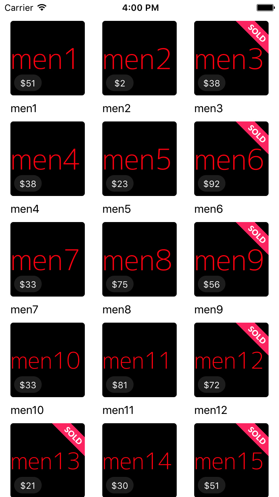
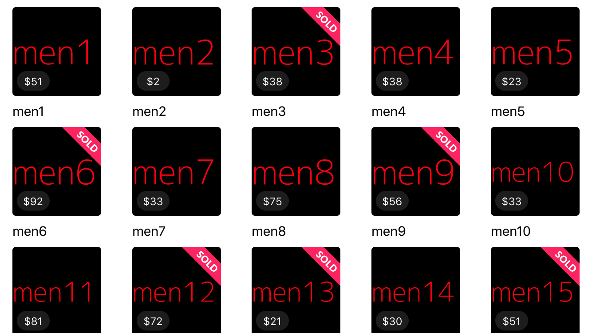

# Process For Implentation
For Technical interview

## Description

### Portrait

### Landscape

- I decided to use Swift for my language as it is the option I was most comfortable with.
- While I could of implement each feature natively, I used three of my favorite pods in my application for their robustness and ease of use:
    -SwiftyJSON (https://github.com/SwiftyJSON/SwiftyJSON)
    -Kingfisher (https://github.com/onevcat/Kingfisher)
    -ModelMapper (https://github.com/lyft/mapper)
- I created a  ProductManager that converts the all.json to string, parses it, and return an array of products.
- Products then requested by the ViewController and displayed in the CollectionView

## Recommendations
- I recommend returning paged requests for large datasets. In this way, we could implement lazy loading on the collection view which would increase performance and provide a better experience.

Total Time: 1 hours 58 mins
